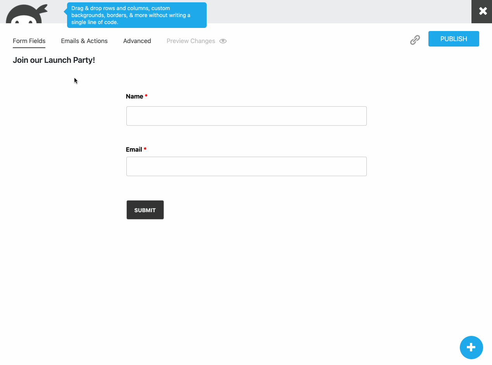
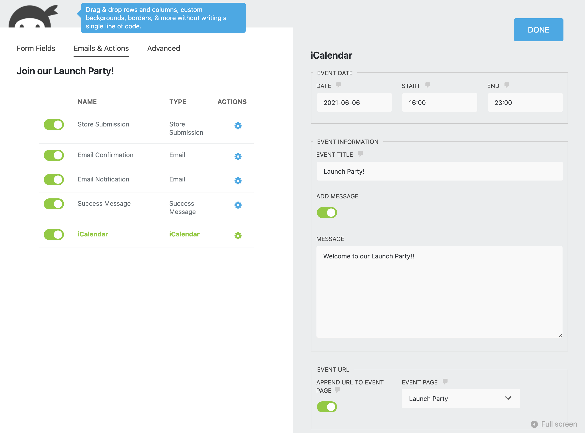

# iCalendar for Ninja Forms

## Description

Add an iCalendar to your Ninja Forms.


## Installation

Prerequisite:
- PHP 7.2-8.0.x
- [Ninja Forms](https://wordpress.org/plugins/ninja-forms/)

You know the drill:
1. [Download the plugin](https://github.com/soderlind/icalendar-ninja-form/archive/refs/heads/main.zip)
1. Upload the plugin via `Plugins->Add New->Upload`
1. Activate the plugin.
1. Use Ninja Forms to add the iCalendar.


## Use

### Per event form, add the action:



### Add event date etc:



### Add link to Success Message, Email Confirmation etc:

- **Link** (`{ical:link}`), adds a `<a href=".../event-xyz.ics">Add the event to your calendar</a>` link. The "Add the event to your calendar" text can be changed in iCalendar advanced settings.
- **URL** (`{ical:url}`), adds `http[s]://yoursite.tld/event-xyz.ics`


### Email with iCalendar link


### Example calendar.ics:

```
BEGIN:VCALENDAR
VERSION:2.0
PRODID:-//ZContent.net//ZapCalLib 1.0//EN
CALSCALE:GREGORIAN
METHOD:PUBLISH
BEGIN:VEVENT
SUMMARY:Launch Party!
DTSTART:20210606T160000
DTEND:20210606T230000
ORGANIZER:per@soderlind.no
UID:icalendar-ninja-forms-606e30a0d624e
DTSTAMP:20210407T234034
DESCRIPTION:Welcome to our Launch Party!!\nMore information at: http://party.local/events/launch-party/
END:VEVENT
END:VCALENDAR
```

## Todo

- Validate settings

## Changelog

### 1.1.1

- Add "now" as default date and time.

### 1.1.0

* Add date and time picker

### 1.0.0

* Initial release.


## Credits

iCalendar for Ninja Forms uses the [Zap Calendar iCalendar Library](https://github.com/zcontent/icalendar). The Zap Calendar iCalendar Library has a GNU GPLv3 licence and is Copyright (C) 2006 - 2017 by  [Dan Cogliano](https://zcontent.net/).

## Copyright and License

iCalendar for Ninja Forms is copyright 2021 Per Søderlind

iCalendar for Ninja Forms is free software: you can redistribute it and/or modify it under the terms of the GNU General Public License as published by the Free Software Foundation, either version 2 of the License, or (at your option) any later version.

iCalendar for Ninja Forms is distributed in the hope that it will be useful, but WITHOUT ANY WARRANTY; without even the implied warranty of MERCHANTABILITY or FITNESS FOR A PARTICULAR PURPOSE. See the GNU General Public License for more details.

You should have received a copy of the GNU Lesser General Public License along with the Extension. If not, see http://www.gnu.org/licenses/.
